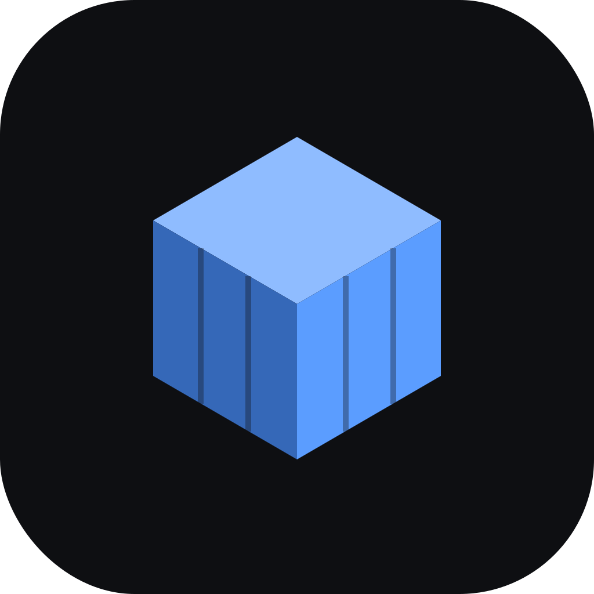
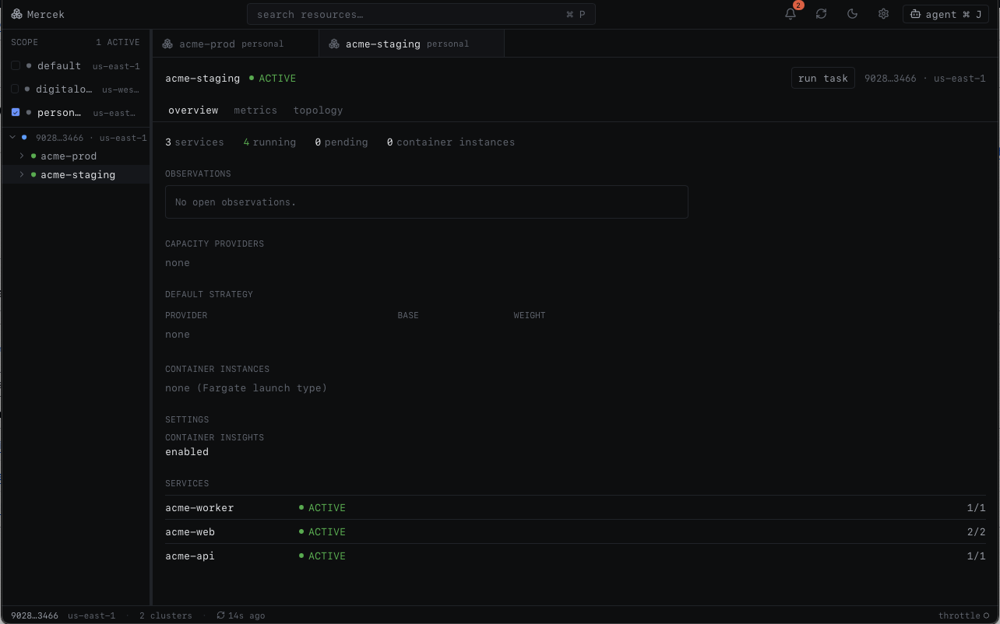

<div align="center">
  
  <h1>Mercek</h1>
  <p><strong>A local-first desktop IDE for Amazon ECS.</strong></p>
  <p>
    <a href="https://github.com/utibeabasi6/mercek/actions/workflows/ci.yml"></a>
    
    
  </p>
</div>

Mercek is a desktop app for Amazon ECS. It uses the AWS credentials already on your
machine and shows your services across every account and region. It's read-only until
you approve a change, and it talks to AWS directly, with no server in between and no
telemetry.



## Why

The AWS console is slow for everyday ECS work, and it's hard to see across accounts.
Mercek puts your services in one window so you can check rollouts, metrics, logs, cost,
and dependencies without switching tabs and accounts.

## Features

- **Multi-account, multi-region discovery** from your `~/.aws` profiles (SSO,
  assume-role, MFA, static keys), with opt-in per-profile scopes.
- **Multi-cluster overview** — a home view with service health (failed / degraded /
  deploying / healthy) across every active scope, and a "needs attention" list.
- **Service / cluster / task detail** — deployments, events, tasks, target health,
  autoscaling, metrics, right-sizing, environment, networking, containers.
- **Deployments & rollback** — live rollout state, circuit-breaker status, one-click
  rollback, a per-service deployment timeline, one-step image deploys, and
  cross-environment / cross-region comparison.
- **Create & manage** — create clusters, services, and task definitions (from scratch),
  run one-off tasks, and delete / deregister them — every write behind a diff or
  confirmation, with VPC / subnets / security groups picked from menus, not typed.
- **Logs** — CloudWatch log tail in a bottom drawer, across every task of a service or
  just one, with a text filter, level highlighting, and copy / download.
- **ECS Exec** — an interactive shell into a running container, with a one-click path to
  enable execute-command on a service that doesn't have it yet.
- **Metrics & cost** — CPU / memory / ALB via Container Insights with an AWS/ECS
  fallback; a selectable 1h–7d window with deploys marked on the charts; a Fargate cost
  estimate and a right-sizing verdict from real peaks.
- **Topology map** — internet → target group → service, plus dependency edges inferred
  from task-definition environment variables.
- **Sentinel** — a background watcher that flags drift, stalled deploys, flapping tasks,
  OOM kills, and image vulnerabilities.
- **Image security** — ECR vulnerability-scan severity per service image.
- **Agent panel** — connect your own coding agent (e.g. Claude Code) over the Agent
  Client Protocol. It's **read-only to AWS**; any change it proposes opens a
  diff-and-confirm dialog plus the equivalent AWS CLI command.
- **Open in AWS console** — jump to any cluster, service, or task in the AWS console.
- **Stays current** — in-app auto-update checks for new releases and updates in one click.
- **Keyboard-driven** — a ⌘K command palette and bindings throughout.

## Install

macOS (Apple Silicon & Intel), Linux (`.deb` / `.AppImage`), and Windows (`.msi` / `.exe`).
Download the latest build from the
[releases page](https://github.com/utibeabasi6/mercek/releases/latest), or build from
source below. Once installed, Mercek keeps itself up to date — it checks for a new release
on launch and updates in one click.

### Opening it (unsigned build)

Mercek isn't notarized by Apple yet, so on first launch macOS says *"Apple could not
verify 'Mercek' is free of malware…"* — expected for an unsigned app. Open it with any
one of:

- **Terminal** — clear the quarantine flag, then launch normally:
  ```bash
  xattr -dr com.apple.quarantine /Applications/Mercek.app
  ```
- **Finder** — right-click (Control-click) `Mercek.app` → **Open** → **Open**.
- **System Settings → Privacy & Security** → scroll to *"Mercek was blocked"* → **Open Anyway**.

This is a stopgap, not the plan: it works at the OS level today but makes a poor first
impression and Apple keeps tightening it. Signing + notarization is the real fix and
will remove the warning.

## Security model

- **Read-only by default** — writes always go through a diff you confirm.
- **No credentials stored** — uses your existing AWS credential chain; resolved secrets
  are masked to ARNs and never written to disk.
- **No telemetry** — Mercek talks to your AWS account and nothing else.

See [SECURITY.md](./SECURITY.md) to report a vulnerability.

## Build from source

```bash
git clone git@github.com:utibeabasi6/mercek.git
cd mercek
pnpm install
pnpm tauri dev     # run the app
```

Requires a recent Rust toolchain, pnpm, and the
[Tauri prerequisites](https://tauri.app/start/prerequisites/) for your OS.

## Architecture

- **Backend** (`src-tauri/`, Rust): layered as `commands → discovery → resources → aws
  → domain`, with AWS SDK types confined below `resources/`.
- **Frontend** (`src/`, React 19 + TypeScript): feature-sliced under `features/`.
- **Type bridge**: Rust domain types export to TypeScript via `ts-rs`. Never hand-edit
  `src/types/generated/` — run `pnpm gen:types`.
- **Offline tests**: a compile-time `mock` cargo feature swaps in fixtures —
  `cargo test --features mock`.

More in [CONTRIBUTING.md](./CONTRIBUTING.md).

## Contributing

Issues and pull requests are welcome — see [CONTRIBUTING.md](./CONTRIBUTING.md) and our
[Code of Conduct](./CODE_OF_CONDUCT.md). For questions, open a
[discussion](https://github.com/utibeabasi6/mercek/discussions).

## License

[MIT](./LICENSE) © Utibeabasi Umanah

Mercek is not affiliated with Amazon Web Services. ECS, Fargate, CloudWatch, and ECR are
trademarks of Amazon.com, Inc.
